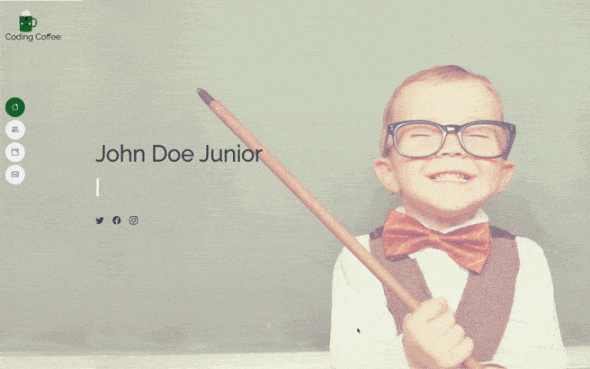
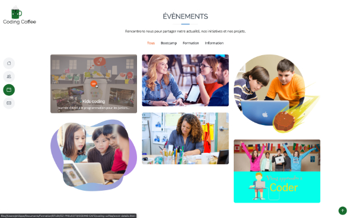
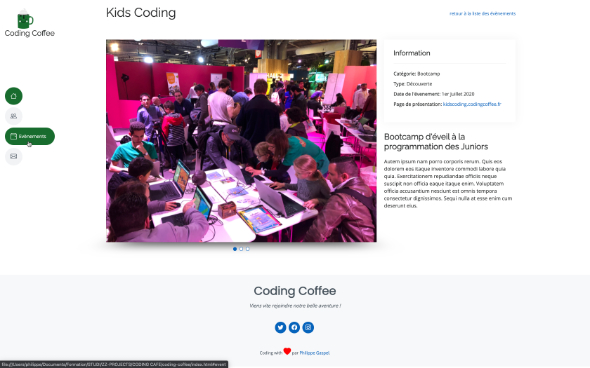

# Coding Coffee Website
[](https://app.netlify.com/sites/codingcoffee/deploys)

> L'apprentissage du code pour tous !

## Sommaire
* [Contexte du projet](#Contexte-du-projet)
* [Visuel](#Visuel)
* [Dev stack](#Dev-Stack)
* [Installation](#Installation)
* [Status](#status)
* [Références](#Références)
* [Contact](#contact)

## Contexte-du-projet
**Création d'un site vitrine pour une association souhaitant présenter son actualité et ses initiatives.**

Ce projet s'inscrit dans le cursus de la formation Studi "full stack Développeur Web et Web Mobile".

Il correspond à l'acquisition des compétences front-end "Réaliser une interface utilisateur web statique et adaptable".

### Résultats attendus
+ Développer et déployer un site web "mobile first" et "responsive" constitué à minima de 2 pages :
    - une page relative à l’association.
    - une page valorisant leurs événements
* Constituer un dépot Git avec le code source du site

## Visuel
1.  [Main page] Hero section avec barre de navigation fixe...cool l'effet sur le texte ;-)
    
    
    

2.  [Main page] Section Evènements
    
    


2.  [Detail page] Page détail de l'évènements
    
    

## Dev-Stack
* HTML 5
* CSS 3
* Boostrap 5

## Installation
+ Clone the repo
   ```sh
   git clone https://github.com/pga61/coding-coffee.git
   ```

## Status
Projet : *en cours d'évaluation STUDI*

## Références
Démo en ligne : [ici](https://codingcoffee.netlify.app/)

Dépôt Github du projet : [ici](https://github.com/pga61/coding-coffee)

## Contact
Coder par [@Philippe](https://philippe-gaspel.me) - feel free to contact me!